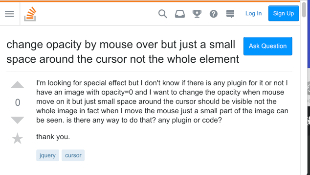
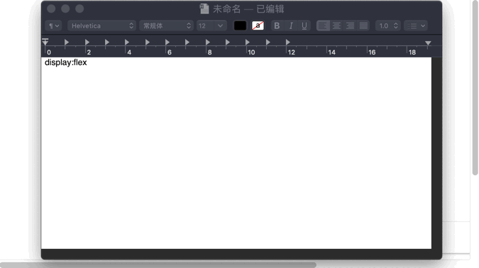
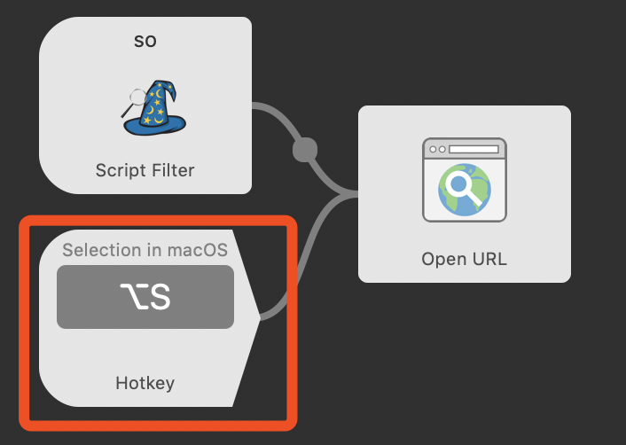
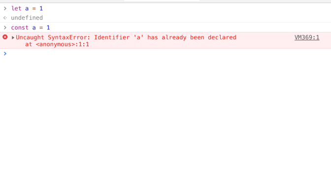

# AlfredMagic
#####  一个面向中文前端开发者效率提升的Alfred插件
 

#####  Require Node.js 8+,[alfred3](https://www.alfredapp.com/) PowerPack.
 

Base on [alfy](https://github.com/sindresorhus/alfy),AppleScript,Alfred,JavaScript.

>本插件针对前端开发者日常碰到的部分琐事进行了WorkFlow化,比较高频的如文档查询/变量命名/驼峰和Action的变量编写规则切换等.亲友均反应有不错的效率提升,在项目高压的时候有奇效.

>希望,它能让你不加班.

**易扩展**,**可配置**,**单独模块可分拆**

**Version 0.0.2**

**注意:由于Alfred自身限制,所有功能快捷键需要您自己设置.可以通过查看文档/Workflow Script中的备注寻找对应的WorkFlow进行快捷键设置**
文档地址:https://codermagefox.github.io/alfredMagic
使用方法:直接下载项目中的AlfredMagic.alfredworkflow双击安装即可.

百度网盘地址:https://pan.baidu.com/s/1Nl0gC9f-9EHbFPugcIzr4g

#####  Code By [CoderMageFox](https://github.com/CoderMageFox) Blog:[No Silver Bullet](http://blog.codermagefox.com/) Mail:codermagefox@codermagefox.com

# 变量命名/网页翻译

#### WorkFlow查询关键字:`vn`

>代码思路参考自CodeVar https://github.com/xudaolong/CodeVar 在此表示感谢.

#### 例子:

####例子:使用变量命名生成一段代码

#### 快捷键查询
在此处设置

设置后选中内容并使用快捷键即可一键翻译.

####在设置中可以直接查看如何选择其他命名方式.提供了action命令以便直接调用大写+下划线写法(0.0.2更新)

# CanIUse兼容性查询
#### WorkFlow查询关键字:`use`
#### 例子:

Tips:

1.CanIUse查询不支持中文,输入中文将直接进入搜索.

2.由于alfy限制,CanIUse查询不支持空格.

#### 快捷键查询
在此处设置

设置后选中内容并使用快捷键即可一键查询.

# MDN文档查询
#### WorkFlow查询关键字:`mdn`
#### 例子:

Tips:

1.MDN搜索基本无限制.如果需要配置英文文档,请参考MDN.js下的注释.

#### 快捷键查询
在此处设置

设置后选中内容并使用快捷键即可一键查询.

# React文档查询/Vue文档查询
#### WorkFlow查询关键字:`react`,`vue`
#### 例子:

Tips:

1.Vue与React文档检索代码部分基本相同,调用的是algolia的搜索,你可以通过修改配置项添加自己的文档搜索,具体见 https://www.algolia.com/doc/api-reference/

2.同理,如果想搜索英文文档,请直接寻找对应的Key做替换即可.

#### 设置与代码
在此处设置

#  ShellHere 

####  WorkFlow查询关键字:`>h` (>是直接执行命令行)

>代码来自 https://github.com/LeEnno/alfred-terminalfinder 

####  例子:(配合Alfred Find命令使用)

#  StackOverFlow中文查询
####  WorkFlow查询关键字:`so`
####  例子:

Tips:

1.使用的API为有道词典标准翻译,不一定准,但是可以省你不少时间.你可以在进入页面后自行修饰搜索词汇.

2.由于未对中英文输入做区分,输入英文可能出现不可预料的Bug.(如果是查报错的话应该就直接用快捷键了吧?没人会再敲一遍吧?)

####  快捷键查询
在此处设置

设置后选中内容并使用快捷键即可一键查询.

**注意!使用API查询的方式是有限制的(一定时间内300次),如果频繁查询可能会出现400错误.因为这个问题我将节流时间调的很大,如果用起来体验不佳请自行调整Script的节流时间.**
